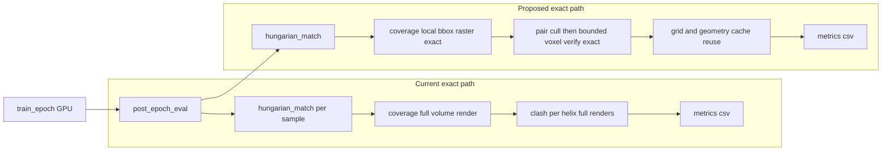

# Algorithm Freeze Optimization Extension (Exact-Metric Preserving)

## 1) Problem framing

This note focuses on the training symptom seen on Slurm: epoch progress appears to "freeze" while GPU utilization drops and CPU stays high.

### Observed behavior
- GPU memory remains allocated (model is still alive), but GPU compute utilization can drop near zero.
- CPU becomes the bottleneck during post-epoch work.
- This can happen even with `training.num_workers: 0`, so it is not only DataLoader multiprocessing deadlock.

### Why this can look like a deadlock but is not
In the current pipeline, heavy evaluation work runs after minibatch training and is mostly CPU-side. That means the training progress bar can stop updating while post-epoch metric code keeps running.

---

## 2) Evidence from current code path

### 2.1 Epoch control flow
In `density2sse/train/trainer.py`, each epoch does:
1. `train_epoch(...)` (GPU-heavy)
2. train metrics pass via `aggregate_metrics_loader(...)`
3. `validate_epoch(...)`
4. val metrics pass via `aggregate_metrics_loader(...)`
5. overlay export via `viz_export.save_example_overlays(...)`
6. checkpoint + CSV writes

The project now logs stage timings, but algorithmic cost remains mainly in metrics/rendering.

### 2.2 Metric hotspot decomposition
In `density2sse/train/metrics.py`:
- `aggregate_metrics_loader(...)` loops over batches and then over each sample.
- For each sample, `_sample_metrics_one(...)` performs:
  - Hungarian match (`matching.hungarian_match(...)`)
  - coverage render using full 3D occupancy from `render_helices_binary(...)`
  - clash calculation by rendering each helix separately and summing overlap voxels
- There are repeated tensor->NumPy transfers (`_to_np`) and repeated full-volume traversals.

### 2.3 Dataset robustness note
`density2sse/data/dataset.py` now uses `with np.load(path) as z:` to ensure NPZ handle closure. This improves FS robustness but does not remove the core post-epoch metric complexity.

### 2.4 Existing knobs
`density2sse/config.py` and `README.md` expose runtime controls:
- `metrics_every_n_epochs`
- `metrics_train_max_batches`
- `val_metrics_max_batches`
- `metrics_compute_coverage`
- `metrics_compute_clash`
- `viz_enabled`, `viz_every_n_epochs`, `viz_n_examples`

These reduce workload by scheduling and toggling. They do not yet optimize exact metric kernels themselves.

---

## 3) Root-cause model (algorithm level)

The apparent freeze is dominated by CPU-heavy exact metric work:

- Coverage cost grows with volume size: approximately O(B * N_voxels) per evaluated batch in the render phase.
- Clash cost is worse: per sample, rendering each helix separately and accumulating overlaps scales with helix count and volume size.
- These runs are executed post-epoch and often on full/large validation slices.
- GPU can idle because post-epoch metric kernels are NumPy/CPU-oriented.

In short: high wall-time in exact post-epoch metrics, not necessarily deadlock.

---

## 4) Exactness-preserving optimization proposals

The target is to preserve metric definitions (`coverage_ratio`, `clash_voxels`, geometric errors) while reducing compute time.

## 4.1 Proposal A: Exact clash acceleration via geometric pair culling + bounded voxel verification

Current pattern:
- Render each helix to full grid, sum all masks, count voxels with occupancy >= 2.

Optimization idea (exact):
1. Build conservative geometric bounds (capsules/tubes with radius) for each predicted helix.
2. Fast pairwise cull in continuous space (AABB/capsule distance lower bound).
3. Only for candidate colliding pairs, rasterize/verify on the minimal shared bounding voxel region.
4. Accumulate exact overlap voxels from candidate regions only.

Why exactness is preserved:
- Culling only removes pairs proven non-overlapping.
- Candidate region verification still uses exact voxel rule currently used by renderer.

Expected impact:
- Large reduction when many helices are spatially separated.

Risk:
- Medium: needs careful conservative bounds to avoid false negatives.

## 4.2 Proposal B: Exact coverage acceleration with tight bounding-box rasterization

Current pattern:
- Render union of all predicted helices on full grid and intersect with GT mask.

Optimization idea (exact):
1. For each predicted helix, compute voxel-space tight AABB expanded by tube radius.
2. Rasterize only inside local box, not whole volume.
3. OR into a sparse/global boolean accumulator.
4. Compute intersection and denominator exactly as before.

Why exactness is preserved:
- Same voxel inclusion criterion; only evaluation domain is pruned to guaranteed-relevant voxels.

Expected impact:
- Strong gains when tube support occupies a small fraction of the cube.

Risk:
- Low to medium: careful integer box boundaries needed.

## 4.3 Proposal C: Cache and reuse deterministic geometry components

Optimization idea:
- Cache per-configuration static tensors/arrays (voxel center grids, index maps).
- Cache reusable per-helix local coordinate structures when `(box_size, voxel_size, tube_radius)` fixed and shape patterns repeat.

Why exactness is preserved:
- Pure memoization of deterministic intermediates.

Expected impact:
- Moderate constant-factor speedup.

Risk:
- Low.

## 4.4 Proposal D: Vectorized torch kernel path for exact metrics

Optimization idea:
- Port render/overlap kernels to torch tensor ops (CPU vectorized first, optional CUDA path).
- Keep threshold logic and mask semantics exactly identical.

Why exactness is preserved:
- Math and threshold conditions are unchanged; only implementation backend changes.

Expected impact:
- Potentially large (especially with CUDA evaluation), and better overlap with training pipeline.

Risk:
- Medium to high: must ensure strict numerical/boolean equivalence.

## 4.5 Proposal E: Exact-by-policy scheduling

Keep metric definition exact but schedule expensive exact pass strategically:
- lightweight periodic metrics during training
- mandatory full exact evaluation at selected checkpoints and final model

This is already partially available via config knobs; should remain part of production policy.

---

## 5) Current vs optimized pipeline

---

## 6) Prioritized roadmap

### Phase 1 (low risk, fastest delivery)
- Add profiler counters around metric internals (coverage vs clash vs matching wall-time split).
- Implement static grid cache and small memoization.
- Keep all outputs bitwise/near-bitwise consistent with current baseline.

### Phase 2 (medium risk, core speedup)
- Implement exact local-box coverage renderer.
- Implement exact clash candidate culling + bounded overlap verification.
- Validate equivalence with golden outputs.

### Phase 3 (higher engineering effort)
- Implement vectorized torch metric kernels (CPU first, optional CUDA).
- Add reproducibility/equivalence harness against NumPy baseline.

---

## 7) Validation protocol (exactness + speed)

## 7.1 Equivalence checks
For each optimization phase, compare against baseline implementation on fixed seeds:
- `center_error`, `angle_error`, `length_error` absolute diff <= 1e-6
- `coverage_ratio` absolute diff <= 1e-7
- `clash_voxels` exact integer match (or float-cast equivalent)
- `loss_total` absolute diff <= 1e-6

If float backend changes make bitwise match impossible, document deterministic tolerance bands.

## 7.2 Performance checks
Record stage-level wall-time for:
- `train_metrics`
- `val_metrics`
- `viz_export`

Target speedups (initial practical goals):
- Phase 1: 1.2x to 1.5x metric stage speedup
- Phase 2: 2x to 4x on larger `box_size`/`K_max`
- Phase 3: additional gains depending on hardware and tensor backend

## 7.3 Benchmark matrix
Run matrix across:
- `box_size`: 64 / 96 / 128
- `K_max`: 10 / 20 / 30
- batch size: 4 / 8 / 16
- metric mode: full exact each epoch vs periodic exact

Report mean and p95 epoch post-eval time.

---

## 8) Recommended exact-mode production policy (cluster)

For long Slurm jobs:
1. Keep exact metric formulas as canonical definition.
2. Run periodic exact metrics during training (reduced cadence).
3. Run full exact metrics at milestone epochs and final checkpoint.
4. Disable overlays except milestone epochs.

Example policy:
- `metrics_every_n_epochs: 2` or `5`
- `val_metrics_max_batches` capped for routine epochs
- full exact uncapped pass for final model selection stage

---

## 9) Next implementation PR checklist

- [ ] Add internal profiler split in metrics kernel functions (match/coverage/clash).
- [ ] Implement exact local-box coverage rasterization.
- [ ] Implement exact clash pair-culling with conservative bounds.
- [ ] Add cache layer for static voxel geometry structures.
- [ ] Add equivalence regression tests against current baseline metrics.
- [ ] Add benchmark script and produce stage-time report for Slurm profiles.
- [ ] Update README with exact-optimization status and recommended production cadence.
